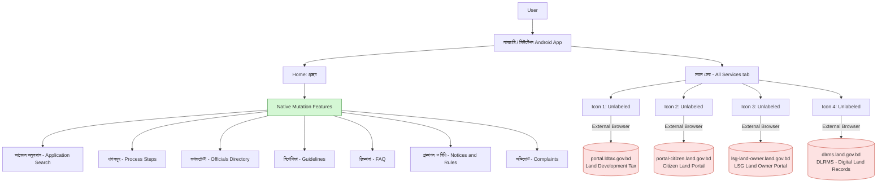
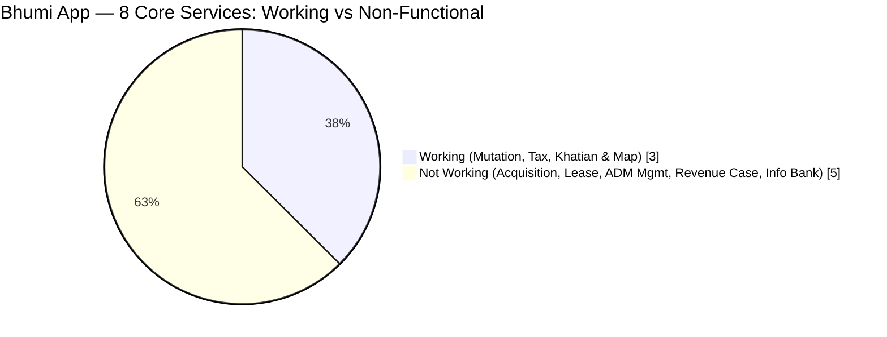
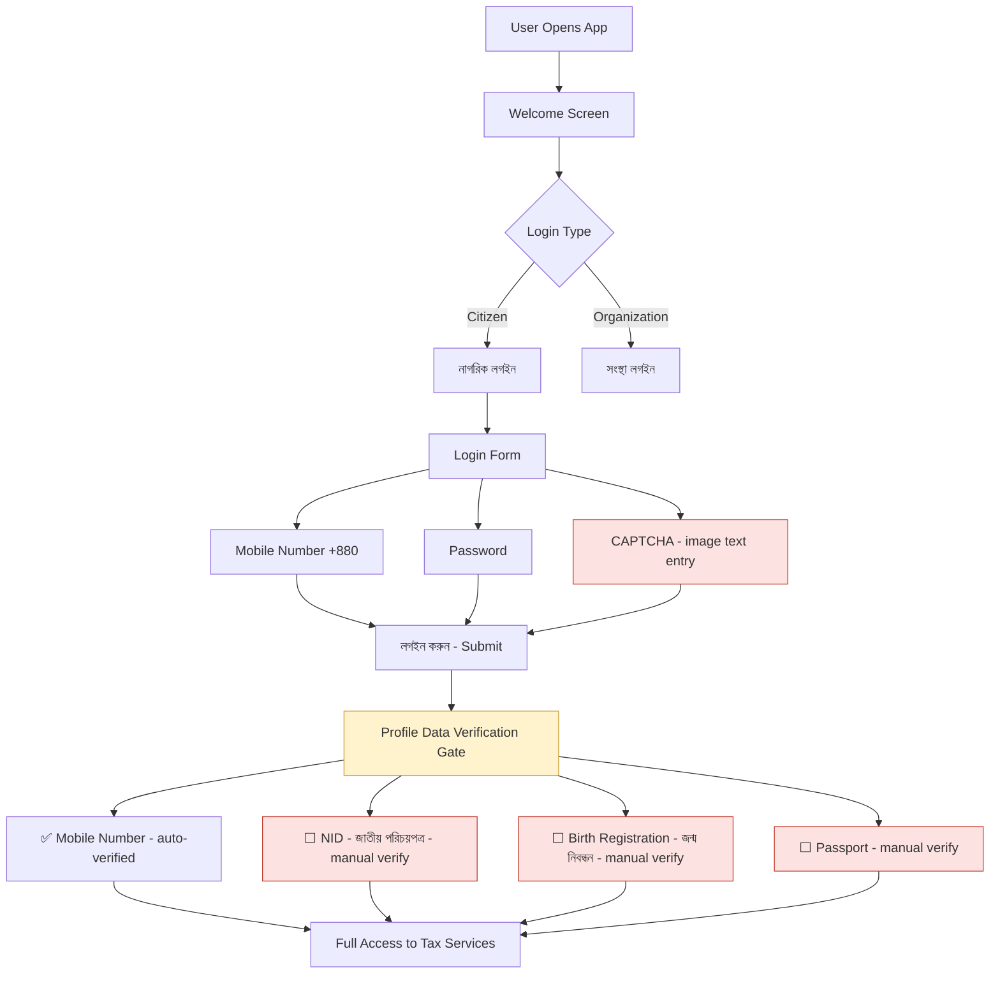
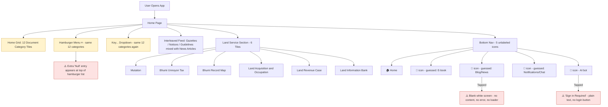
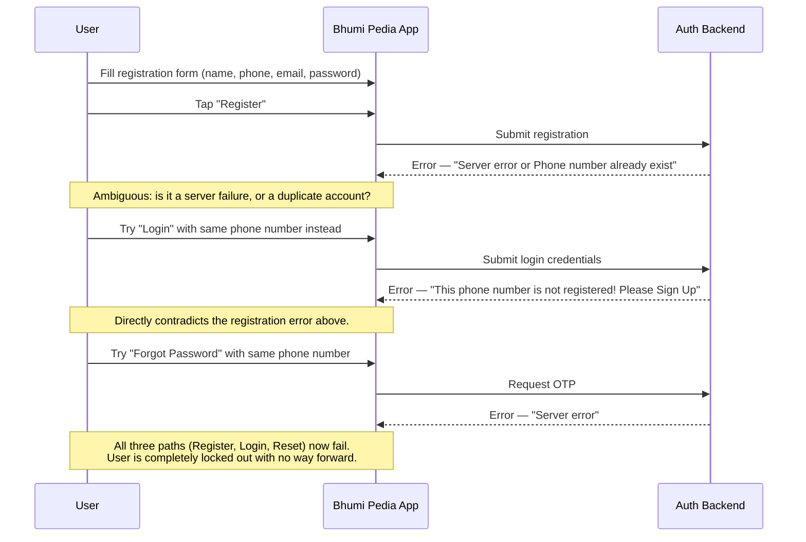

# Land Research

# Gap Analysis: Government-Funded Land Management Apps in Bangladesh
## Objective

To evaluate the current state of Bangladesh's government-funded land management apps and document:
- Missing or incomplete service coverage
- Weaknesses in app architecture / UX flow
- Performance issues
- Recommendations for improvement

## Scope
This review covers the govt-funded land management apps available on the Play Store, including:
| App Name | Publisher | Primary Function 
| নামজারি (branded in-app as "মিউটেশন") | Ministry of Land (developed by Business Automation Ltd.) | Land mutation (name transfer) tracking |
| ভূমি (Bhumi) | Ministry of Land | Consolidated land services (mutation, land tax, e-Porcha, mouza maps) |
| ভূমি উন্নয়ন কর | Ministry of Land | Land development tax payment |
| ভূমি পিডিয়া | Ministry of Land | Land-related information repository |

### App Details (from in-app "About" page)

- **App name (branding):** নামজারি / মিউটেশন
- **Version reviewed:** 3.3.17
- **Owner:** Ministry of Land, Government of Bangladesh
- **Developed by:** Business Automation Ltd. (on behalf of Ministry of Land)
- **Stated purpose:** "Developed in addition to land portal (land.gov.bd) to ease the Mutation service of Bangladesh government."

## Architecture / Infrastructure Description
### High-level architecture

**Observed components:**

- **Client Layer:** Native Android application, functioning mainly as a shell for the mutation workflow (application tracking, officials directory, guidelines, complaints).
- **Core Service Handling:** Only mutation-specific features are handled natively inside the app.
- **External Dependency Layer:** The "সকল সেবা" (All Services) tab exposes **4 unlabeled icons** that, on tap, hand off to **4 separate government web domains** via the external browser rather than an in-app view:
  - `portal.ldtax.gov.bd` : Land Development Tax
  - `portal-citizen.land.gov.bd` : Citizen Land Portal
  - `lsg-land-owner.land.gov.bd` : LSG Land Owner Portal
  - `dlrms.land.gov.bd` : DLRMS (Digital Land Records Management System)
- **No shared session layer:** Each portal appears to run its own independent login/session, separate from the app and from each other.

This confirms the backend is a **collection of siloed government web portals**, each serving one service domain, with the mobile app acting as a thin, single-purpose wrapper (mutation) plus a set of bare links to the rest.

---

## Findings — Gaps & Limitations

### 1. Narrow Service Scope (By Design)
The app's own "About" page states it exists specifically to "ease the Mutation service" , confirming this is not an oversight but a deliberate scoping decision. Other essential land management services (land tax, citizen land records, LSG land ownership, DLRMS) are **not integrated** as native features; they exist only as external links.

### 2. Slow App Loading / Startup Performance
On launch, the app exhibits noticeably slow loading before the home screen becomes usable. For a citizen service app used for time-sensitive submissions (mutation deadlines, fee payments), this is a meaningful usability barrier, especially on lower-end devices or weaker network connections, which are common among the app's target users.

### 3. Unlabeled Navigation Icons ("সকল সেবা")
The "All Services" tab presents **4 icons with no text labels**. Users cannot know what each icon leads to without tapping it first : a significant discoverability and trust problem, especially for a government app where users need confidence before entering sensitive personal/land data.

### 4. Broken In-App Experience via External Browser Redirects
Each of the 4 "সকল সেবা" icons redirects to a **separate external domain in the device's default browser** instead of:
- Opening an in-app WebView, or
- Providing a native in-app module for that service

## Recommendations

- **Label every icon** in "সকল সেবা" clearly : a one-line UX fix with an outsized trust/usability benefit.
- **Replace external browser redirects with in-app WebViews** at minimum, to preserve navigation context and branding.
- **Introduce a shared authentication/session layer** (e.g. SSO) across `land.gov.bd`, `ldtax.gov.bd`, and related subdomains so users log in once.
- **Optimize app startup performance** : investigate whether slow loading is due to unnecessary network calls on launch, unoptimized assets, or backend latency.
- **Consolidate services long-term:** the existing **ভূমি (Bhumi)** app appears to already attempt integrating mutation + tax + records : worth a direct comparison in a future version of this report.
- **API-first backend design** so any single app can pull all land services through one unified interface instead of four separate portals.
.
.
.
.
.
.
.
.
.
.
.
# Gap Analysis: ভূমি (Bhumi) App — Beta Version Review
## Objective

To evaluate ভূমি's current functionality and document:
- UI/UX accessibility issues for its target user base
- Release readiness (beta status, broken features)
- Actual vs. advertised service coverage
- Recommendations for improvement

## App Details

- **Status:** Explicitly labeled **"(বেটা ভার্সন)"** (Beta Version) in the app header.
- **Tagline:** "এক ঠিকানায় ভূমিসেবা" : positions itself as the unified land-service destination.
- **Menu structure:** A hamburger menu with **16 items** : Home, Services, Offices, Laws & Rules, Notices, Notifications, Nearest LSFC Office, Calculator, QR Code, Accessibility, Settings, Complaints, FAQ, Feedback, About Us, Login . all displayed **in English**.
- **Core services grid:** 8 tiles on the home screen : Mutation, Land Development Tax, Khatian and Map, Land Acquisition, Lease Management, Land ADM Mgmt, Land Revenue Case, Land Information Bank.

## Architecture / Infrastructure Description
### Service & menu structure

```mermaid
flowchart TD
    A[User] --> B[ভূমি App - Beta]
    B --> C[Hamburger Menu - 16 items, English only]
    B --> D[Home Screen: 8 Core Service Tiles]

    D --> S1[✅ Mutation - Working]
    D --> S2[✅ Land Development Tax - Working]
    D --> S3[✅ Khatian and Map - Working]
    D --> S4[❌ Land Acquisition - No data found]
    D --> S5[❌ Lease Management - Under construction]
    D --> S6[❌ Land ADM Mgmt - Under construction]
    D --> S7[❌ Land Revenue Case - Under construction]
    D --> S8[❌ Land Information Bank - Under construction]

    C --> M1[✅ Offices - Division/District/Upazila locator - Working]
    C --> M2[✅ QR Code - Document verification - Working]
    C --> M3[✅ FAQ - Working]
    C --> M4[❌ Calculator - Under construction popup]
    C --> M5[❓ Notices / Notifications / Complaints / Settings / etc. - Untested]

    style S1 fill:#d4f7d4,stroke:#2d862d
    style S2 fill:#d4f7d4,stroke:#2d862d
    style S3 fill:#d4f7d4,stroke:#2d862d
    style S4 fill:#fde2e2,stroke:#c0392b
    style S5 fill:#fde2e2,stroke:#c0392b
    style S6 fill:#fde2e2,stroke:#c0392b
    style S7 fill:#fde2e2,stroke:#c0392b
    style S8 fill:#fde2e2,stroke:#c0392b
    style M1 fill:#d4f7d4,stroke:#2d862d
    style M2 fill:#d4f7d4,stroke:#2d862d
    style M3 fill:#d4f7d4,stroke:#2d862d
    style M4 fill:#fde2e2,stroke:#c0392b
```

### Service completion status

**Observed components:**

- **Client Layer:** Native app intended to be the unified land-services hub, avoiding the external-redirect pattern seen in other Ministry apps.
- **Menu Layer:** 16 English-only menu entries; at least one (Calculator) returns a **"This service is under construction"** popup on tap.
- **Service Layer:** Of the 8 headline service tiles, only **3 are functional** : Mutation, Land Development Tax, and Khatian and Map. The remaining 5 show either an empty **"No data found"** state or a **"দুঃখিত, সেবাটি নির্মাণাধীন"** ("Sorry, this service is under construction") screen.
- **Working auxiliary features:** Office locator (Division → District → Upazila/Circle, with a Land Office / Citizen Land Service Center toggle), QR code document verification (branded "VumiSheba"), and FAQ all work independently of the main 8 services.
- **Localization / QA defect:** The home banner reads **"THE MINISTRY OF LAND IS V 30 August 2026"**, and the under-construction screen reads **"WORKING TO DELIVER CITIZE[N] ... 30 August 2026."** These read like two halves of one sentence that a template/placeholder failed to render . a sign the beta shipped without full QA on its dynamic text strings.

## Findings — Gaps & Limitations

### 1. UI/UX Overload for the Target Audience
A 16-item, **English-only** hamburger menu : including technically-named entries like "Land ADM Mgmt" and "Nearest LSFC Office" . is a heavy cognitive load for an app whose actual end users are the general Bengali-speaking public, many with limited English proficiency or technical familiarity. There is no visible language toggle to switch the interface to Bengali.

### 2. App Still Officially in Beta
The **"(বেটা ভার্সন)"** tag is shown directly in the app header. A beta-labeled build being distributed as the Ministry's primary "all land services in one place" app sets citizen expectations poorly and signals the developers themselves don't consider it production-ready.

### 3. Majority of Advertised Services Are Non-Functional
Of the 8 core services advertised on the home screen, only 3 actually work. The other 5 : **Land Acquisition, Lease Management, Land ADM Mgmt, Land Revenue Case, and Land Information Bank** that return either an empty "No data found" state or an explicit "under construction" message. In practice, the app currently delivers roughly **37.5%** of its own advertised core functionality.

### 4. Broken / Incomplete UI Strings
Malformed banner and popup text (e.g. "THE MINISTRY OF LAND IS V 30 August 2026", "WORKING TO DELIVER CITIZE...") indicate unfinished localization or template logic shipped to production : a quality-assurance gap rather than a content or design decision.

## Recommendations

- **Add a Bengali-language toggle** and simplify/regroup the 16-item menu for non-technical users : group related items (Notices/Notifications, Complaints/Feedback) instead of listing all 16 flat.
- **Communicate beta limitations honestly:** replace silent "No data found" / generic "under construction" dead-ends with a clear "Coming Soon" state that sets expectations rather than looking broken.
- **Prioritize finishing the 5 non-functional core services** (Land Acquisition, Lease Management, Land ADM Mgmt, Land Revenue Case, Land Information Bank) before promoting the app further as a complete solution.
- **Fix the malformed template strings** : indicates a need for a stronger QA/localization review step before release.
- **Consider a phased public rollout:** hide or clearly gate not-yet-working tiles instead of shipping all 8 visibly, which currently makes ~62% of the home screen a dead end for users.
.
.
.
.
.
.
.
.
.
.
.
# Gap Analysis: ভূমি উন্নয়ন কর (Land Development Tax) App
## Objective

To evaluate the app's onboarding/authentication experience and document:
- Session persistence issues
- Identity verification burden on the user
- Recommendations for improvement

## App Details

- **Full name:** ভূমি উন্নয়ন কর ব্যবস্থাপনা সিস্টেম (Land Development Tax Management System)
- **Login options:** নাগরিক লগইন (Citizen Login) and সংস্থা লগইন (Organization Login)
- **Language toggle:** English/Bengali (বাং) switch present on the welcome screen

## Architecture / Infrastructure Description
### Authentication & onboarding flow

**Observed components:**

- **Login layer:** Mobile number + password + a manually-typed CAPTCHA, required on **every** login . there is no persistent session, "remember me," biometric unlock, or refresh-token mechanism observed. Logging out means repeating the entire flow, CAPTCHA included, next time.
- **Identity verification gate:** After login, before the app is usable, the user is asked to verify **four separate identifiers simultaneously**: mobile number (auto-verified from login), National ID (NID), Birth Registration, and Passport . each requiring a separate "যাচাই করুন" (Verify) action, likely against different government identity systems (NID database, birth registration database, passport database).
- **No apparent fallback/partial-access path:** The screen frames this as required "to complete the ভূমি উন্নয়ন কর profile," suggesting a citizen without all four documents readily available/verifiable digitally could be blocked from progressing.

## Findings — Gaps & Limitations

### 1. No Persistent Session — Full Re-Login Required Every Time
Once a user logs out, there is no lighter-weight way back in. Every session start requires re-entering the mobile number, password, and a freshly generated CAPTCHA. For a service citizens may need to check periodically (e.g. tax due dates, payment confirmations), this repeated friction discourages regular use and increases the chance of failed login attempts (mistyped CAPTCHA, forgotten password prompting resets).

### 2. Four Simultaneous Identity Verifications Required
To complete the profile, the user must verify **NID, Birth Registration, and Passport** all at once (mobile is auto-verified via login). This is a heavy burden:
- Not every citizen holds a passport, so requiring it alongside NID and birth registration risks excluding a segment of legitimate taxpayers who only have one or two of these documents.
- Presenting all four as needed **simultaneously**, rather than accepting any one valid national identifier, adds unnecessary friction to a process that fundamentally just needs to confirm "who is this taxpayer."
- No visible explanation for *why* three separate document types are needed for a tax-payment app, which can come across as disproportionate data collection for the stated purpose.

## Recommendations

- **Introduce persistent sessions:** support "remember this device," refresh tokens, or biometric/PIN unlock so returning users aren't forced through full CAPTCHA-based login every time.
- **Reduce CAPTCHA friction:** consider CAPTCHA only after repeated failed attempts (adaptive/risk-based) rather than on every single login.
- **Make identity verification flexible, not simultaneous:** allow the user to complete their profile with **any one strong identifier** (NID is typically sufficient for Bangladeshi citizens) rather than requiring NID, Birth Registration, and Passport all at once. Reserve additional verification for edge cases (e.g. no NID available).
- **Explain the "why":** a short note on why each document is requested (e.g. NID for identity, Passport only if NID unavailable) would reduce user confusion and hesitation around sharing sensitive documents.
- **Allow partial/staged access:** let users view basic tax information before full identity verification is complete, reserving full verification for the payment step where it's actually necessary.
.
.
.
.
.
.
.
.
.
.
# Gap Analysis: ভূমি পিডিয়া (Bhumi Pedia) App
## 🎯 Objective

To evaluate ভূমি পিডিয়া's information architecture and account system, and document:
- Redundant/repetitive navigation structures
- Unclear content organization (documents vs. news)
- Unlabeled navigation elements
- Account registration and authentication reliability

---

## App Details

- **Purpose:** Central repository for land-related legal/regulatory documents plus land service shortcuts and Ministry news.
- **Home page document categories (12):** Acts, Ordinances, Presidentorders, Rules, Policies, Guidelines, Circulars, Notifications, Mous, Manuals, Gazettes, Others.
- **Land Service shortcuts (6):** Mutation, Bhumi Unnoyon Tax, Bhumi Record Map, Land Acquisition and Occupation, Land Revenue Case, Land Information Bank.
- **Bottom navigation:** 5 icon-only tabs : Home, and four further tabs the reviewer had to guess at by icon alone (E-book, Blog/News, a chat-style icon, and an AI bot icon).

---

## Architecture / Infrastructure Description

The app's home page surfaces the same 12 document categories through **three separate, redundant UI paths**, mixes legal-document content with news/blog content in the same feed without clear visual separation, and gates some bottom-nav features behind a login wall that isn't consistently or clearly communicated.

### Home page navigation structure

### The critical issue: authentication dead-end

Testing registration and login with the same phone number produced two **contradictory** server responses, and the recovery path failed outright:

**Observed components:**
- **Redundant navigation layer:** The same 12 document categories are exposed through the home grid, the hamburger drawer, and a separate "Key..." filter dropdown , three different UI surfaces doing the same job, with no apparent reason for the duplication.
- **Data/rendering bug:** The hamburger menu additionally shows a stray **"Null"** entry above the real categories , a classic symptom of an unhandled empty/undefined value being rendered directly into the UI list.
- **Mixed content model:** Legal documents (Gazettes, Guidelines, Orders) and Ministry news/blog posts (with view/like/comment/share counts) appear in the same interleaved feed and grid layout, with no clear visual distinction between "this is an official document" and "this is a news post."
- **Unlabeled, inconsistent bottom navigation:** None of the 5 bottom tabs carry text labels. Two of them lead to broken or unclear states , one to a completely blank screen, another to a bare "Sign in Required" message with no visible way to actually sign in from that screen.
- **Broken authentication loop:** Registration, login, and password-reset each fail in ways that contradict one another, leaving no working path into an account.

## Findings — Gaps & Limitations

### 1. Triple-Redundant Document Category Navigation
The same 12 categories (Acts, Ordinances, Rules, Policies, etc.) are shown on the home grid, again in the hamburger menu, and again in the "Key..." dropdown , three ways to reach the identical list. This adds visual clutter and cognitive overhead without adding any distinct functionality.

### 2. "Null" Entry in Hamburger Menu (Rendering Bug)
The slide-out menu shows a broken **"Null"** item above the real category list , a visible software defect that undermines confidence in a government information portal.

### 3. Legal Documents and News Content Interleaved Without Separation
Between the document categories and the "Land Service" section, the feed mixes official gazettes/notices with Ministry news articles in the same visual format. A citizen looking for a specific regulation has to sift through unrelated news posts to find it, and vice versa.

### 4. Unlabeled Bottom Navigation Icons
All 5 bottom tabs are icon-only. The reviewer could only guess at three of them (E-book, Blog, Notifications) by shape alone , a discoverability problem consistent with the other Ministry of Land apps reviewed in this series.

### 5. Broken/Unclear Gated States
Tapping the icon guessed to be "Blog/News" produces a **completely blank screen** : no content, no loading indicator, no error message. Tapping the AI bot icon shows **"Sign in Required"** as plain unstyled text, with no visible button or link to actually go log in from that screen.

### 6. Critical: Contradictory, Fully Broken Authentication Flow
This is the most severe issue found:
- **Registering** a new account with a phone number returns: *"Server error or Phone number already exist."*
- **Logging in** with that same phone number returns: *"This phone number is not registered! Please click Sign Up button for Registration!"*
- **Resetting the password** for that same phone number via OTP returns: *"Server error."*

All three paths contradict each other and all three fail. A user hitting this cannot register, cannot log in, and cannot recover their account , a complete dead end that blocks access to any feature requiring sign-in (including the AI bot noted above).

## Recommendations

- **Consolidate document navigation to a single source of truth** : pick one of the home grid, hamburger menu, or dropdown filter as the primary category browser and remove (or clearly differentiate the purpose of) the others.
- **Fix the "Null" rendering bug** in the hamburger menu : indicates a missing null/empty check in the menu data source.
- **Visually separate legal documents from news content** : distinct card styles, section headers, or separate tabs so citizens can tell an official gazette apart from a news post at a glance.
- **Label every bottom navigation icon** with text, consistent with the recurring pattern seen across all four Ministry of Land apps reviewed in this series.
- **Replace blank/bare error states with real UI:** a proper empty state or loading indicator instead of a blank screen, and a functional "Login" button directly on the "Sign in Required" screen.
- **Fix the authentication backend immediately** : this is a launch-blocking defect. Registration, login, and password reset must return **consistent, accurate** states: if a number is already registered, login should work; if it doesn't exist, registration should succeed; and OTP delivery must not fail outright. This should be treated as the highest-priority fix in this report, since it fully locks users out of the app's account-gated features.

## Conclusion

1.ভূমি is architecturally the more ambitious of the Ministry's land apps — a genuine attempt at a single, unified service hub rather than a thin wrapper pointing elsewhere. But its beta status is not just a label: 5 of its 8 headline services are non-functional, its menu is inaccessible to much of its target audience due to English-only labeling, and visible template/localization bugs suggest the release shipped ahead of adequate QA. The auxiliary features that do work (office locator, QR verification, FAQ) show the underlying capability is there — the gap is in completion and polish, not concept.
 
---

2. ভূমি পিডিয়া is conceptually a reasonable idea , a single home for land-related legal documents . but its execution has real structural and technical problems. The home page repeats itself three times over for no functional benefit, mixes legal documents with news content in a way that undermines its purpose as a reference repository, and leaves navigation icons unlabeled just like its sibling apps in this ecosystem. Most seriously, its authentication system is fully broken: registration, login, and password recovery each fail with mutually contradictory error messages, meaning no new user can currently create and access an account at all. Of all four apps reviewed in this series, this is the one with the most severe, launch-blocking defect.
.
.
.
.
.
.
.
.
.
.