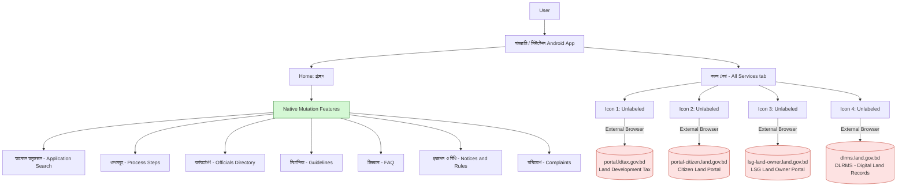

# Land Research

# Gap Analysis: Government-Funded Land Management Apps in Bangladesh
## 🎯 Objective

To evaluate the current state of Bangladesh's government-funded land management apps and document:
- Missing or incomplete service coverage
- Weaknesses in app architecture / UX flow
- Performance issues
- Recommendations for improvement

## 🗂️ Scope
This review covers the govt-funded land management apps available on the Play Store, including:
| App Name | Publisher | Primary Function ||---|---|---|
| নামজারি (branded in-app as "মিউটেশন") | Ministry of Land (developed by Business Automation Ltd.) | Land mutation (name transfer) tracking |
| ভূমি (Bhumi) | Ministry of Land | Consolidated land services (mutation, land tax, e-Porcha, mouza maps) |
| ভূমি উন্নয়ন কর | Ministry of Land | Land development tax payment |
| ভূমি পিডিয়া | Ministry of Land | Land-related information repository |

### App Details (from in-app "About" page)

- **App name (branding):** নামজারি / মিউটেশন
- **Version reviewed:** 3.3.17
- **Owner:** Ministry of Land, Government of Bangladesh
- **Developed by:** Business Automation Ltd. (on behalf of Ministry of Land)
- **Stated purpose:** "Developed in addition to land portal (land.gov.bd) to ease the Mutation service of Bangladesh government."

## Architecture / Infrastructure Description
### High-level architecture

**Observed components:**

- **Client Layer:** Native Android application, functioning mainly as a shell for the mutation workflow (application tracking, officials directory, guidelines, complaints).
- **Core Service Handling:** Only mutation-specific features are handled natively inside the app.
- **External Dependency Layer:** The "সকল সেবা" (All Services) tab exposes **4 unlabeled icons** that, on tap, hand off to **4 separate government web domains** via the external browser rather than an in-app view:
  - `portal.ldtax.gov.bd` — Land Development Tax
  - `portal-citizen.land.gov.bd` — Citizen Land Portal
  - `lsg-land-owner.land.gov.bd` — LSG Land Owner Portal
  - `dlrms.land.gov.bd` — DLRMS (Digital Land Records Management System)
- **No shared session layer:** Each portal appears to run its own independent login/session, separate from the app and from each other.

This confirms the backend is a **collection of siloed government web portals**, each serving one service domain, with the mobile app acting as a thin, single-purpose wrapper (mutation) plus a set of bare links to the rest.

---

## 🔍 Findings — Gaps & Limitations

### 1. Narrow Service Scope (By Design)
The app's own "About" page states it exists specifically to "ease the Mutation service" — confirming this is not an oversight but a deliberate scoping decision. Other essential land management services (land tax, citizen land records, LSG land ownership, DLRMS) are **not integrated** as native features; they exist only as external links.

### 2. Slow App Loading / Startup Performance
On launch, the app exhibits noticeably slow loading before the home screen becomes usable. For a citizen service app used for time-sensitive submissions (mutation deadlines, fee payments), this is a meaningful usability barrier — especially on lower-end devices or weaker network connections, which are common among the app's target users.

### 3. Unlabeled Navigation Icons ("সকল সেবা")
The "All Services" tab presents **4 icons with no text labels**. Users cannot know what each icon leads to without tapping it first — a significant discoverability and trust problem, especially for a government app where users need confidence before entering sensitive personal/land data.

### 4. Broken In-App Experience via External Browser Redirects
Each of the 4 "সকল সেবা" icons redirects to a **separate external domain in the device's default browser** instead of:
- Opening an in-app WebView, or
- Providing a native in-app module for that service

## ✅ Recommendations

- **Label every icon** in "সকল সেবা" clearly — a one-line UX fix with an outsized trust/usability benefit.
- **Replace external browser redirects with in-app WebViews** at minimum, to preserve navigation context and branding.
- **Introduce a shared authentication/session layer** (e.g. SSO) across `land.gov.bd`, `ldtax.gov.bd`, and related subdomains so users log in once.
- **Optimize app startup performance** — investigate whether slow loading is due to unnecessary network calls on launch, unoptimized assets, or backend latency.
- **Consolidate services long-term:** the existing **ভূমি (Bhumi)** app appears to already attempt integrating mutation + tax + records — worth a direct comparison in a future version of this report.
- **API-first backend design** so any single app can pull all land services through one unified interface instead of four separate portals.
