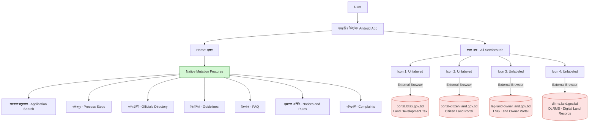
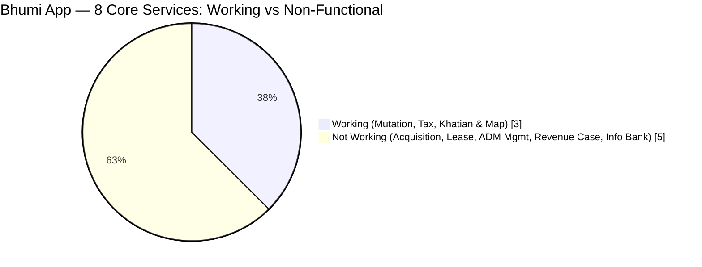

# Land Research

# Gap Analysis: Government-Funded Land Management Apps in Bangladesh
## Objective

To evaluate the current state of Bangladesh's government-funded land management apps and document:
- Missing or incomplete service coverage
- Weaknesses in app architecture / UX flow
- Performance issues
- Recommendations for improvement

## Scope
This review covers the govt-funded land management apps available on the Play Store, including:
| App Name | Publisher | Primary Function 
| নামজারি (branded in-app as "মিউটেশন") | Ministry of Land (developed by Business Automation Ltd.) | Land mutation (name transfer) tracking |
| ভূমি (Bhumi) | Ministry of Land | Consolidated land services (mutation, land tax, e-Porcha, mouza maps) |
| ভূমি উন্নয়ন কর | Ministry of Land | Land development tax payment |
| ভূমি পিডিয়া | Ministry of Land | Land-related information repository |

### App Details (from in-app "About" page)

- **App name (branding):** নামজারি / মিউটেশন
- **Version reviewed:** 3.3.17
- **Owner:** Ministry of Land, Government of Bangladesh
- **Developed by:** Business Automation Ltd. (on behalf of Ministry of Land)
- **Stated purpose:** "Developed in addition to land portal (land.gov.bd) to ease the Mutation service of Bangladesh government."

## Architecture / Infrastructure Description
### High-level architecture

**Observed components:**

- **Client Layer:** Native Android application, functioning mainly as a shell for the mutation workflow (application tracking, officials directory, guidelines, complaints).
- **Core Service Handling:** Only mutation-specific features are handled natively inside the app.
- **External Dependency Layer:** The "সকল সেবা" (All Services) tab exposes **4 unlabeled icons** that, on tap, hand off to **4 separate government web domains** via the external browser rather than an in-app view:
  - `portal.ldtax.gov.bd` : Land Development Tax
  - `portal-citizen.land.gov.bd` : Citizen Land Portal
  - `lsg-land-owner.land.gov.bd` : LSG Land Owner Portal
  - `dlrms.land.gov.bd` : DLRMS (Digital Land Records Management System)
- **No shared session layer:** Each portal appears to run its own independent login/session, separate from the app and from each other.

This confirms the backend is a **collection of siloed government web portals**, each serving one service domain, with the mobile app acting as a thin, single-purpose wrapper (mutation) plus a set of bare links to the rest.

---

## Findings — Gaps & Limitations

### 1. Narrow Service Scope (By Design)
The app's own "About" page states it exists specifically to "ease the Mutation service" , confirming this is not an oversight but a deliberate scoping decision. Other essential land management services (land tax, citizen land records, LSG land ownership, DLRMS) are **not integrated** as native features; they exist only as external links.

### 2. Slow App Loading / Startup Performance
On launch, the app exhibits noticeably slow loading before the home screen becomes usable. For a citizen service app used for time-sensitive submissions (mutation deadlines, fee payments), this is a meaningful usability barrier, especially on lower-end devices or weaker network connections, which are common among the app's target users.

### 3. Unlabeled Navigation Icons ("সকল সেবা")
The "All Services" tab presents **4 icons with no text labels**. Users cannot know what each icon leads to without tapping it first : a significant discoverability and trust problem, especially for a government app where users need confidence before entering sensitive personal/land data.

### 4. Broken In-App Experience via External Browser Redirects
Each of the 4 "সকল সেবা" icons redirects to a **separate external domain in the device's default browser** instead of:
- Opening an in-app WebView, or
- Providing a native in-app module for that service

## Recommendations

- **Label every icon** in "সকল সেবা" clearly : a one-line UX fix with an outsized trust/usability benefit.
- **Replace external browser redirects with in-app WebViews** at minimum, to preserve navigation context and branding.
- **Introduce a shared authentication/session layer** (e.g. SSO) across `land.gov.bd`, `ldtax.gov.bd`, and related subdomains so users log in once.
- **Optimize app startup performance** : investigate whether slow loading is due to unnecessary network calls on launch, unoptimized assets, or backend latency.
- **Consolidate services long-term:** the existing **ভূমি (Bhumi)** app appears to already attempt integrating mutation + tax + records : worth a direct comparison in a future version of this report.
- **API-first backend design** so any single app can pull all land services through one unified interface instead of four separate portals.

# Gap Analysis: ভূমি (Bhumi) App — Beta Version Review
## Objective

To evaluate ভূমি's current functionality and document:
- UI/UX accessibility issues for its target user base
- Release readiness (beta status, broken features)
- Actual vs. advertised service coverage
- Recommendations for improvement

## App Details

- **Status:** Explicitly labeled **"(বেটা ভার্সন)"** (Beta Version) in the app header.
- **Tagline:** "এক ঠিকানায় ভূমিসেবা" : positions itself as the unified land-service destination.
- **Menu structure:** A hamburger menu with **16 items** : Home, Services, Offices, Laws & Rules, Notices, Notifications, Nearest LSFC Office, Calculator, QR Code, Accessibility, Settings, Complaints, FAQ, Feedback, About Us, Login . all displayed **in English**.
- **Core services grid:** 8 tiles on the home screen : Mutation, Land Development Tax, Khatian and Map, Land Acquisition, Lease Management, Land ADM Mgmt, Land Revenue Case, Land Information Bank.

## Architecture / Infrastructure Description
### Service & menu structure

```mermaid
flowchart TD
    A[User] --> B[ভূমি App - Beta]
    B --> C[Hamburger Menu - 16 items, English only]
    B --> D[Home Screen: 8 Core Service Tiles]

    D --> S1[✅ Mutation - Working]
    D --> S2[✅ Land Development Tax - Working]
    D --> S3[✅ Khatian and Map - Working]
    D --> S4[❌ Land Acquisition - No data found]
    D --> S5[❌ Lease Management - Under construction]
    D --> S6[❌ Land ADM Mgmt - Under construction]
    D --> S7[❌ Land Revenue Case - Under construction]
    D --> S8[❌ Land Information Bank - Under construction]

    C --> M1[✅ Offices - Division/District/Upazila locator - Working]
    C --> M2[✅ QR Code - Document verification - Working]
    C --> M3[✅ FAQ - Working]
    C --> M4[❌ Calculator - Under construction popup]
    C --> M5[❓ Notices / Notifications / Complaints / Settings / etc. - Untested]

    style S1 fill:#d4f7d4,stroke:#2d862d
    style S2 fill:#d4f7d4,stroke:#2d862d
    style S3 fill:#d4f7d4,stroke:#2d862d
    style S4 fill:#fde2e2,stroke:#c0392b
    style S5 fill:#fde2e2,stroke:#c0392b
    style S6 fill:#fde2e2,stroke:#c0392b
    style S7 fill:#fde2e2,stroke:#c0392b
    style S8 fill:#fde2e2,stroke:#c0392b
    style M1 fill:#d4f7d4,stroke:#2d862d
    style M2 fill:#d4f7d4,stroke:#2d862d
    style M3 fill:#d4f7d4,stroke:#2d862d
    style M4 fill:#fde2e2,stroke:#c0392b
```

### Service completion status

**Observed components:**

- **Client Layer:** Native app intended to be the unified land-services hub, avoiding the external-redirect pattern seen in other Ministry apps.
- **Menu Layer:** 16 English-only menu entries; at least one (Calculator) returns a **"This service is under construction"** popup on tap.
- **Service Layer:** Of the 8 headline service tiles, only **3 are functional** : Mutation, Land Development Tax, and Khatian and Map. The remaining 5 show either an empty **"No data found"** state or a **"দুঃখিত, সেবাটি নির্মাণাধীন"** ("Sorry, this service is under construction") screen.
- **Working auxiliary features:** Office locator (Division → District → Upazila/Circle, with a Land Office / Citizen Land Service Center toggle), QR code document verification (branded "VumiSheba"), and FAQ all work independently of the main 8 services.
- **Localization / QA defect:** The home banner reads **"THE MINISTRY OF LAND IS V 30 August 2026"**, and the under-construction screen reads **"WORKING TO DELIVER CITIZE[N] ... 30 August 2026."** These read like two halves of one sentence that a template/placeholder failed to render — a sign the beta shipped without full QA on its dynamic text strings.

## Findings — Gaps & Limitations

### 1. UI/UX Overload for the Target Audience
A 16-item, **English-only** hamburger menu : including technically-named entries like "Land ADM Mgmt" and "Nearest LSFC Office" — is a heavy cognitive load for an app whose actual end users are the general Bengali-speaking public, many with limited English proficiency or technical familiarity. There is no visible language toggle to switch the interface to Bengali.

### 2. App Still Officially in Beta
The **"(বেটা ভার্সন)"** tag is shown directly in the app header. A beta-labeled build being distributed as the Ministry's primary "all land services in one place" app sets citizen expectations poorly and signals the developers themselves don't consider it production-ready.

### 3. Majority of Advertised Services Are Non-Functional
Of the 8 core services advertised on the home screen, only 3 actually work. The other 5 : **Land Acquisition, Lease Management, Land ADM Mgmt, Land Revenue Case, and Land Information Bank** that return either an empty "No data found" state or an explicit "under construction" message. In practice, the app currently delivers roughly **37.5%** of its own advertised core functionality.

### 4. Broken / Incomplete UI Strings
Malformed banner and popup text (e.g. "THE MINISTRY OF LAND IS V 30 August 2026", "WORKING TO DELIVER CITIZE...") indicate unfinished localization or template logic shipped to production : a quality-assurance gap rather than a content or design decision.

## Recommendations

- **Add a Bengali-language toggle** and simplify/regroup the 16-item menu for non-technical users : group related items (Notices/Notifications, Complaints/Feedback) instead of listing all 16 flat.
- **Communicate beta limitations honestly:** replace silent "No data found" / generic "under construction" dead-ends with a clear "Coming Soon" state that sets expectations rather than looking broken.
- **Prioritize finishing the 5 non-functional core services** (Land Acquisition, Lease Management, Land ADM Mgmt, Land Revenue Case, Land Information Bank) before promoting the app further as a complete solution.
- **Fix the malformed template strings** : indicates a need for a stronger QA/localization review step before release.
- **Consider a phased public rollout:** hide or clearly gate not-yet-working tiles instead of shipping all 8 visibly, which currently makes ~62% of the home screen a dead end for users.